# Computer Vision - ECE661 - Purdue Univerity

### Homework-1
- **Homogeneous Coordinate Representations**  
  - Representation of points, lines, and conics.
- **Intersection of Lines**  
  - Computing the intersection point using the cross product.
- **Laser Aim Game Simulation**  
  - Utilizing homogeneous coordinates to determine whether the aim is correct (indicated by a green color).

<!-- 

  <figure style="margin: 0px 0px; text-align: center;">
    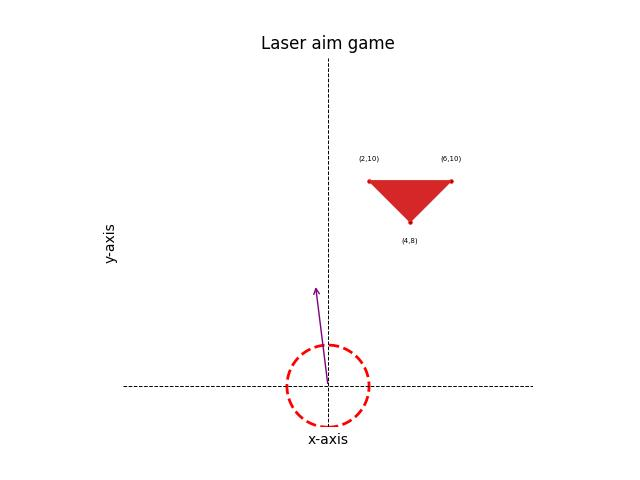
  </figure>
  <figure style="margin: 0px 0px; text-align: center;">
    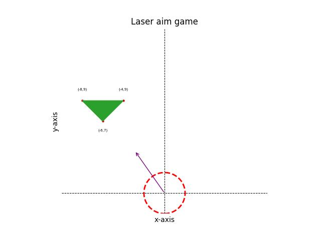
  </figure>
  <figure style="margin: 0px 0px; text-align: center;">
    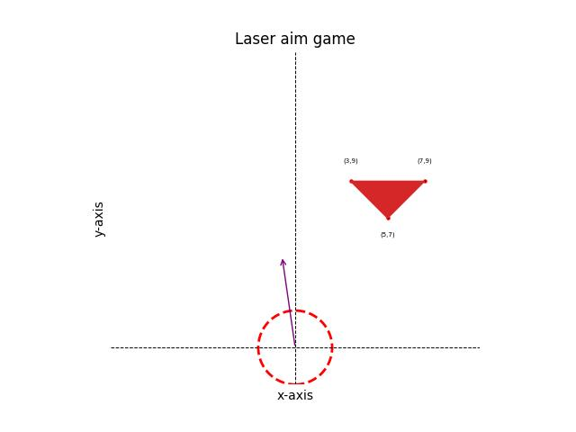
  </figure>
    <figure style="margin: 0px 0px; text-align: center;">
    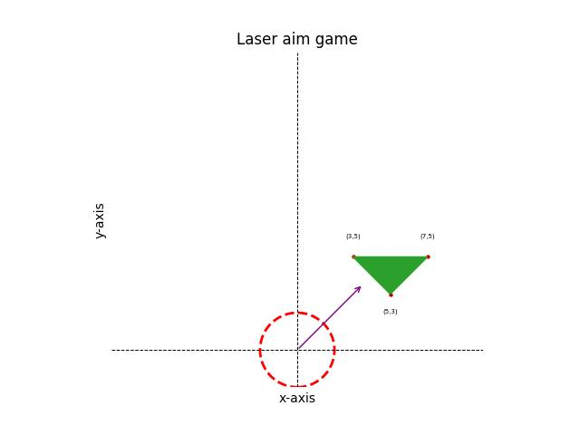
  </figure>

<strong>Fig. 1:</strong> Laser Aim Simulation
 -->

    
    
    
    

<strong>Fig. 1:</strong> Laser Aim Simulation

<!-- 
<strong></strong> Common caption for both images
 -->

[View Full Report](./reports/hw1_BilalAhmed.pdf)

### Homework-2
- **Introduction to Homography**  
  - Understanding the concept and mathematical formulation of homography.
- **Using Homography for Image Projection**  
  - Projecting an image onto a frame in another image using homography.

<!-- 

  <figure style="margin: 0px 20px; text-align: center;">
    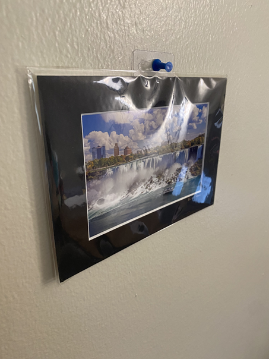
    <figcaption>Original Frame</figcaption>
  </figure>
  <figure style="margin: 40px 20px; text-align: center;">
    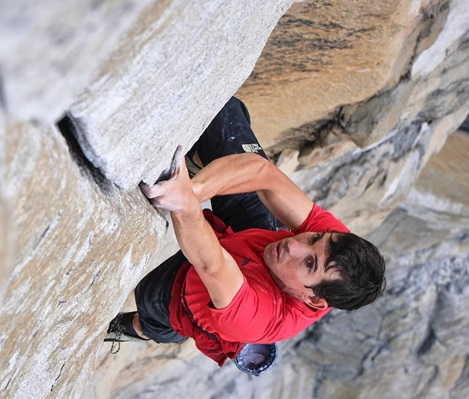
    <figcaption>Input Image</figcaption>
  </figure>
  <figure style="margin: 0px 20px; text-align: center;">
    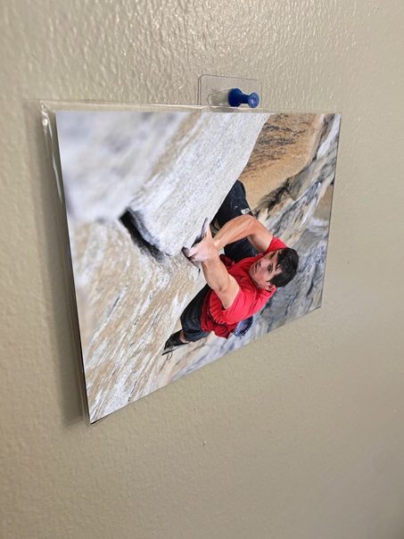
    <figcaption>Projected Image</figcaption>
  </figure>

<strong>Fig. 2:</strong> Image Projected Onto Frame Using Homography
 -->

    
    
    

<strong>Fig. 2:</strong> Image Projected Onto Frame Using Homography

<table style="border:none; display:inline; width: 40%; text-align: center;"> 
    <tr>
    <td style="padding: -10px;"> Original Frame</td>
    <td style="padding: -10px;"> Input Image</td>
    <td style="padding: -10px;"> Projected Image</td>
  </tr>
</table>

<strong>Fig. 2:</strong> Image Projected Onto Frame Using Homography

[View Full Report](./reports/hw2_BilalAhmed.pdf)

### Homework-3
- **Metric Rectification**  
  - Correcting projective and affine distortions in images.
- **Point-to-Point Rectification**  
  - Using corresponding points between the distorted image and the physical or undistorted view.
- **Two-step Rectification**  
  - Removing projective distortion using a vanishing line.
  - Eliminating affine distortion using orthogonal lines.
- **One-step Rectification**  
  - Applying a transformation of a degenerate conic to correct both projective and affine distortions.

    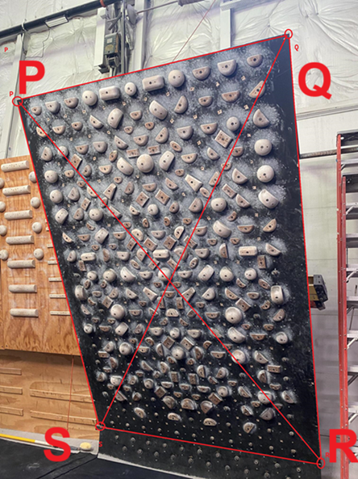
    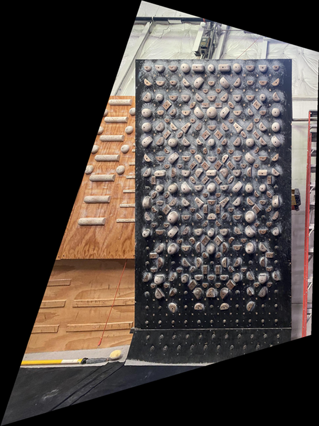
    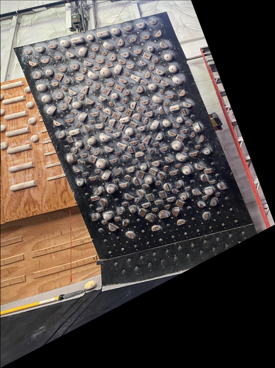
    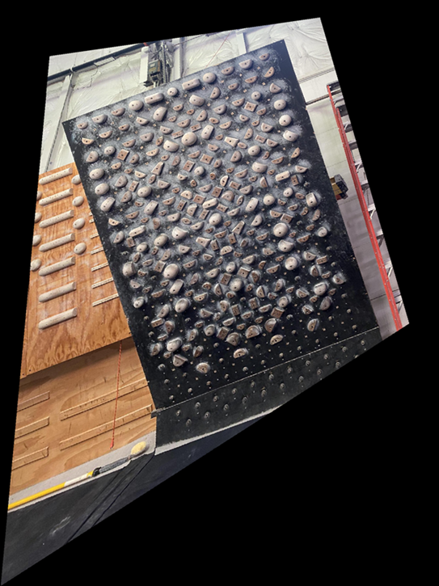

<strong>Fig. 3:</strong> Metric Rectification Example

<!-- 

    <figure style="margin: 0px 10px; text-align: center;">
    
    <figcaption>Distorted Image</figcaption>
  </figure>
  <figure style="margin: 0px 10px; text-align: center;">
    
    <figcaption>Point Matching</figcaption>
  </figure>
  <figure style="margin: 0px 10px; text-align: center;">
    
    <figcaption>Two-Step</figcaption>
  </figure>
  <figure style="margin: 0px 10px; text-align: center;">
    
    <figcaption>One-Step</figcaption>
  </figure>

<strong>Fig. 3:</strong> Metric Rectification Example
 -->

  <figure style="margin: 0px 10px; text-align: center;">
    
    <figcaption>Distorted Image</figcaption>
  </figure>
  <figure style="margin: 0px 10px; text-align: center;">
    
    <figcaption>Point Matching</figcaption>
  </figure>
  <figure style="margin: 0px 10px; text-align: center;">
    
    <figcaption>Two-Step</figcaption>
  </figure>
  <figure style="margin: 0px 10px; text-align: center;">
    
    <figcaption>One-Step</figcaption>
  </figure>

<strong>Fig. 3:</strong> Metric Rectification Example

[View Full Report](./reports/hw3_BilalAhmed.pdf)

### Homework-4
- **Harris Corner Detection**  
  - Implemented interest point detection.  
  - Matched corresponding points between pairs of images using:  
    + Sum of Squared Differences (SSD).  
    + Normalized Cross-Correlation (NCC).  
- **Alternative Methods for Interest Point Detection and Matching**  
  - Used Scale-Invariant Feature Transform (SIFT).  
  - Applied deep learning models, SuperPoint and SuperGlue, for enhanced point detection and matching.

  <figure style="margin: 0px 10px; text-align: center;">
    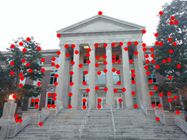
    <!-- <figcaption>Hovde</figcaption> -->
  </figure>
  <figure style="margin: 0px 10px; text-align: center;">
    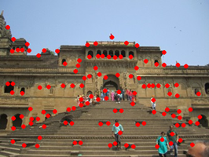
    <!-- <figcaption>Rectified</figcaption> -->
  </figure>

<strong>Fig. 4:</strong> Harris Corner Detection

  <!-- <figure style="margin: 0px 10px; text-align: center;">
    
    <figcaption>Hovde</figcaption>
  </figure> -->
  <figure style="margin: 0px 10px; text-align: center;">
    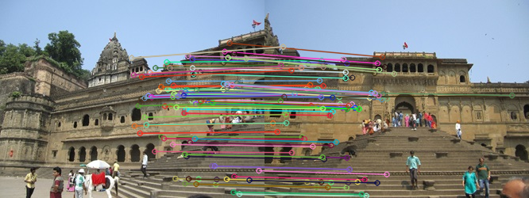
    <!-- <figcaption>Rectified</figcaption> -->
  </figure>

<strong>Fig. 5:</strong> SIFT Points Matching

[View Full Report](./reports/hw4_BilalAhmed.pdf)

### Homework-5
- **Image Mosaicing**  
  - Automated homography estimation between image pairs.  
  - Detected and matched interest points.  
  - Rejected outliers using RANSAC.  
  - Refined homography using Levenberg-Marquardt (LM).  
  - Created a panoramic view using homographies.

  <figure style="margin: 0px 2px; text-align: center;">
    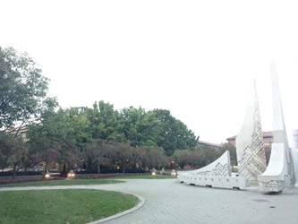
    <!-- <figcaption>Image 1</figcaption> -->
  </figure>
  <figure style="margin: 0px 2px; text-align: center;">
    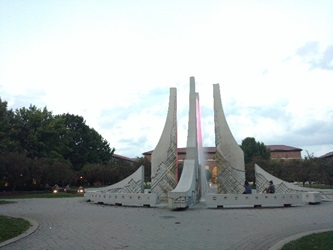
    <!-- <figcaption>Image 2</figcaption> -->
  </figure>
  <figure style="margin: 0px 2px; text-align: center;">
    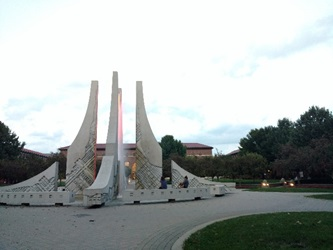
    <!-- <figcaption>Image 3</figcaption> -->
  </figure>
  <figure style="margin: 0px 2px; text-align: center;">
    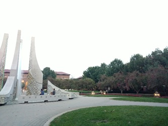
    <!-- <figcaption>Image 4</figcaption> -->
  </figure>
  <figure style="margin: 0px 2px; text-align: center;">
    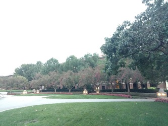
    <!-- <figcaption>Image 5</figcaption> -->
  </figure>

<strong>Fig. 6:</strong> Overlapping Images of the Fountain

  <figure style="margin: 0px 10px; text-align: center;">
    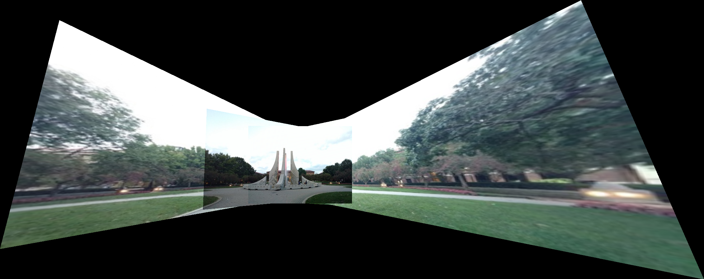
    <!-- <figcaption>Image Mosaic</figcaption> -->
  </figure>

<strong>Fig. 7:</strong> Image Mosaic Created Using Overlapping Images

[View Full Report](./reports/hw5_BilalAhmed.pdf)

### Homework-6  
- **Image Segmentation**  
  - Otsu's Algorithm:  
    - Segmentation using RGB channels.  
    - Texture-based segmentation.  
  - Contour Extraction:  
    - Applied morphological operations for contour extraction.

  <figure style="margin: 0px 5px; text-align: center;">
    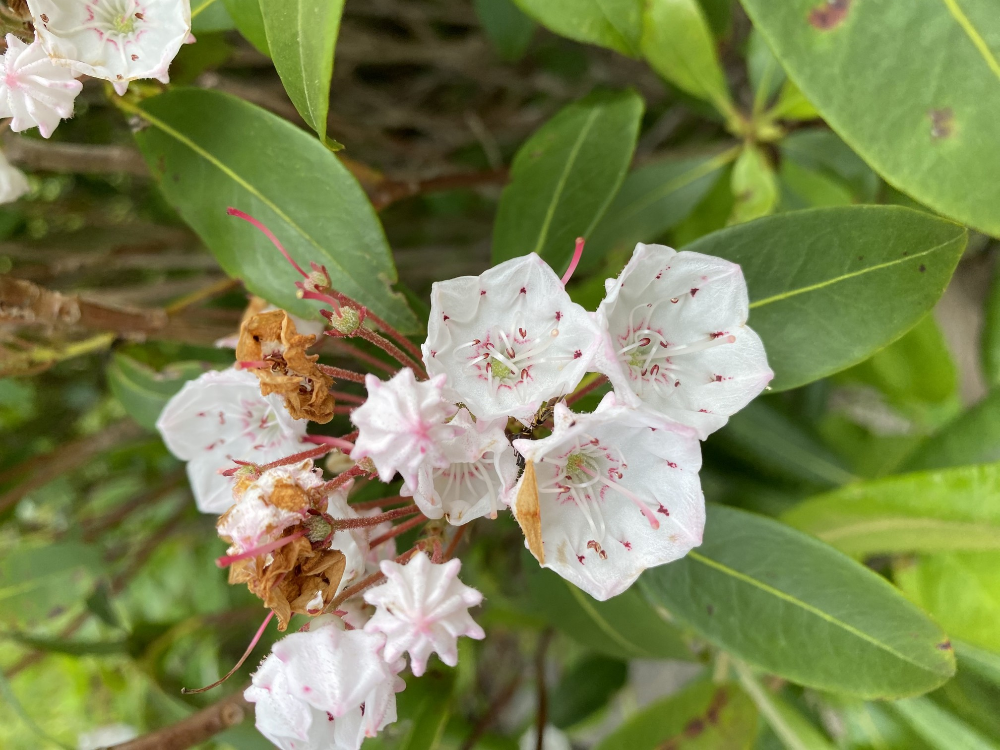
    <figcaption>Original Flower Image</figcaption>
  </figure>
  <figure style="margin: 0px 5px; text-align: center;">
    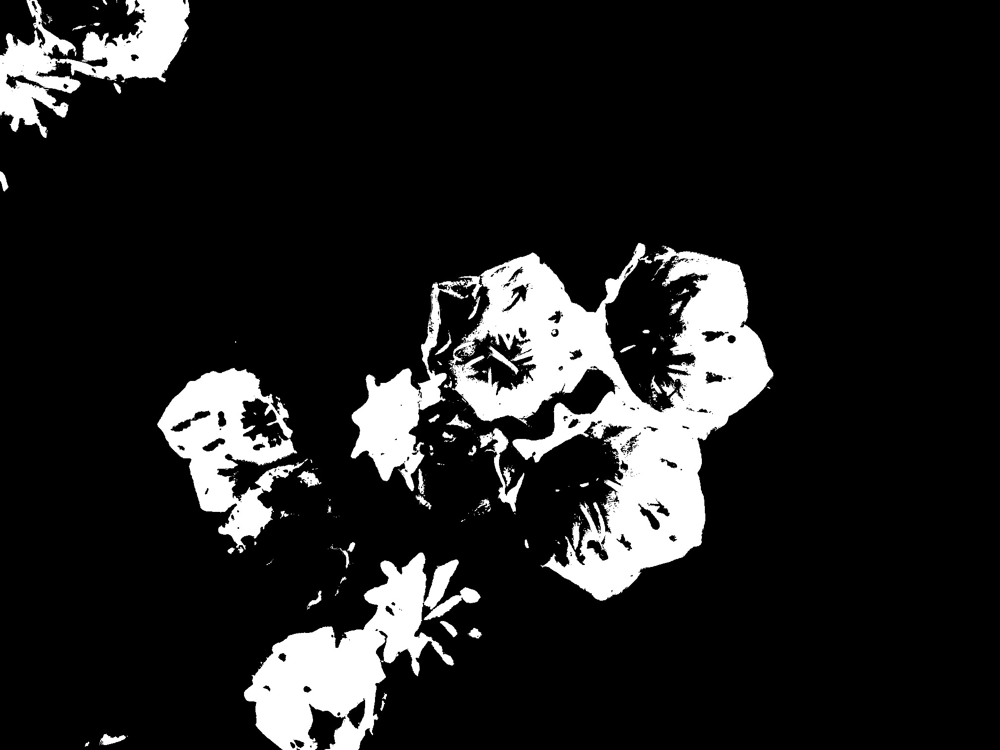
    <figcaption>Segmented Binary Mask</figcaption>
  </figure>
  <figure style="margin: 0px 5px; text-align: center;">
    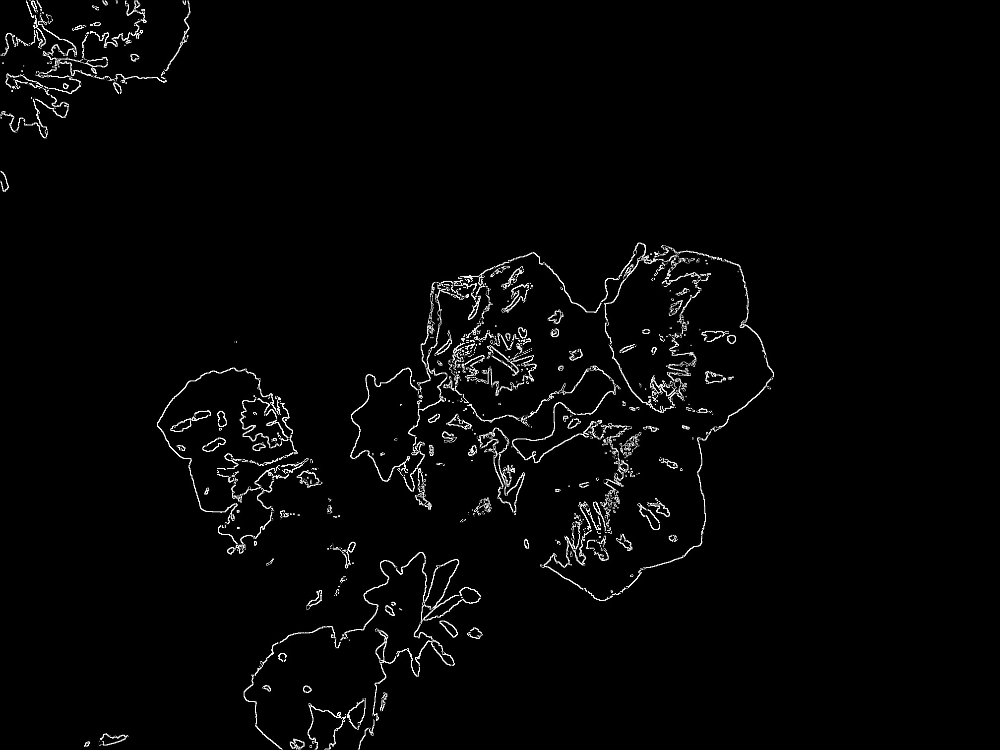
    <figcaption>Extracted Contour Map</figcaption>
  </figure>

<strong>Fig. 8:</strong> Segmentation and Contour Extraction Example

[View Full Report](./reports/hw6_BilalAhmed.pdf)

### Homework-7  
- **Weather Classification Using Various Features**  
    - Local Binary Patterns (LBP): Utilized for texture-based feature extraction.  
    - Deep Neural Network Features: Extracted high-level features using:  
        + VGG  
        + ResNet  
    - Adaptive Instance Normalization (AdaIN): Leveraged style-based features for classification.  

  <figure style="margin: 10px 5px; text-align: center;">
    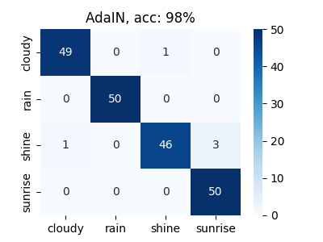
    <!-- <figcaption>Confusion Matrix</figcaption> -->
  </figure>
  <figure style="margin: -10px 5px; text-align: center;">
    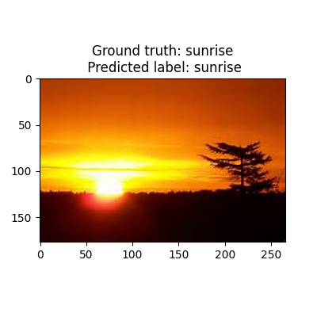
    <!-- <figcaption>Correct Classification Example</figcaption> -->
  </figure>

<strong>Fig. 9:</strong> Confusion Matrix and Classification Example

[View Full Report](./reports/hw7_BilalAhmed.pdf)

### Homework-8  
- **Camera Calibration**  
  - Implemented Zhang's Algorithm:  
    - Detecting corners in a calibration pattern.  
    - Calculating intrinsic parameters.  
    - Calculating extrinsic parameters.  
    - Refining parameter estimates using the Levenberg-Marquardt (LM) algorithm.

  <figure style="margin: 15px 5px; text-align: center;">
    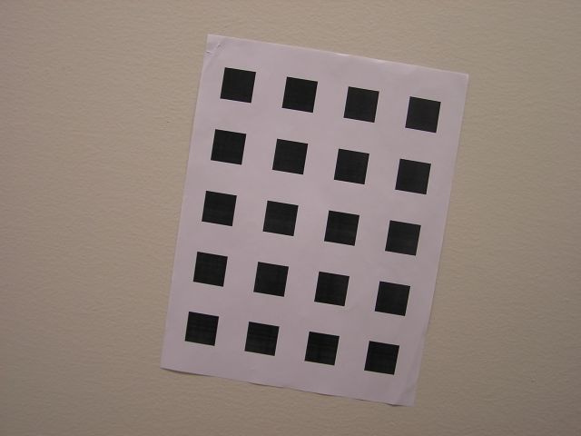
    <figcaption style="margin-top: 12px;">Calibration Pattern View</figcaption>
  </figure>
  <figure style="margin: 0px 5px; text-align: center;">
    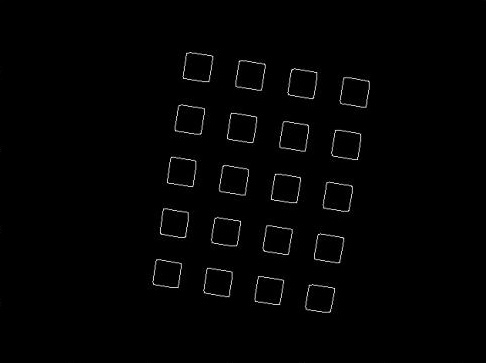
    <figcaption>Detected Boxes</figcaption>
  </figure>
  <figure style="margin: 0px 5px; text-align: center;">
    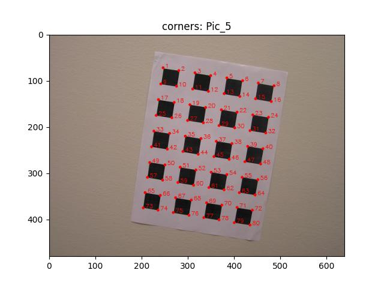
    <figcaption>Detected Corners</figcaption>
  </figure>

<strong>Fig. 10:</strong> Calibration Pattern

  <figure style="margin: 0 10px; text-align: center;">
    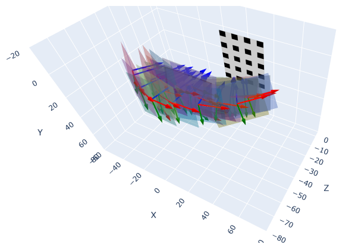
    <!-- <figcaption>Recreated Camera Poses</figcaption> -->
  </figure>

<strong>Fig. 11:</strong> Recreated Camera Poses

[View Full Report](./reports/hw8_BilalAhmed.pdf)

### Homework-9

- **Projective Stereo Reconstruction**:
    - Stereo Rectification: Aligning images to simplify correspondence matching by making epipolar lines horizontal.
    - Interest Point Detection: Identifying distinct features across images for matching.
    - Projective Reconstruction: Reconstructing 3D points from stereo correspondences using projective geometry.

- **Dense Stereo Matching**: Generating disparity maps to find pixel-wise correspondences between stereo images.

- **Extraction of Dense Correspondences using Depth Maps**: Refining disparity maps to generate dense depth information for accurate 3D reconstruction.

  <figure style="margin: 10px; text-align: center;">
    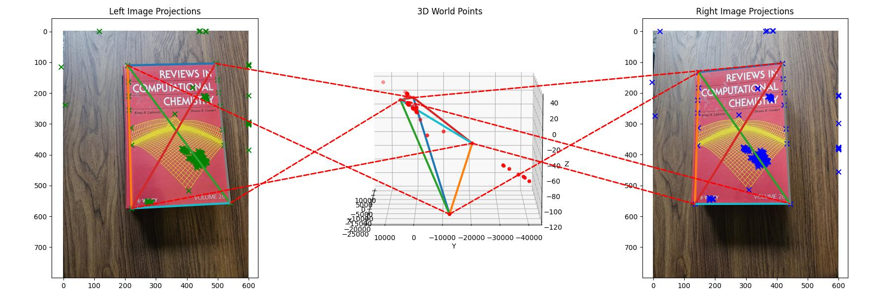
    <figcaption style="margin-top: 12px;">Projective Stereo Reconstruction 3D View</figcaption>
  </figure>

<strong>Fig. 12:</strong> Projective Stereo Reconstruction

[View Full Report](./reports/hw9_BilalAhmed.pdf)

### Homework-10

- **Face Recognition**
    - Dimensionality Reduction:
        - Principal Component Analysis (PCA)
        - Linear Discriminant Analysis (LDA)
        - Variational Autoencoder (VAE)
    - Classification:
        - Nearest Neighbor Classifier

- **Object Detection**
    - Cascaded AdaBoost Classifiers

  <figure style="margin: 10px; text-align: center;">
    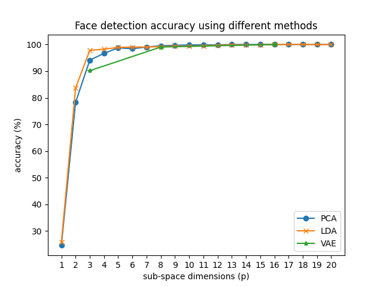
    <figcaption style="margin-top: 5px; font-size: 0.9em; color: #555;">Fig. 13: Face Recognition Accuracy</figcaption>
  </figure>

  <figure style="margin: 10px 5px; text-align: center;">
    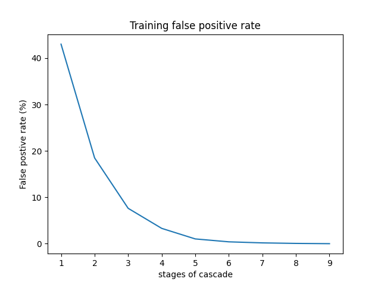
    <figcaption style="margin-top: 10px; font-size: 0.9em; color: #555;">Training</figcaption>
  </figure>
  <figure style="margin: 10px 5px; text-align: center;">
    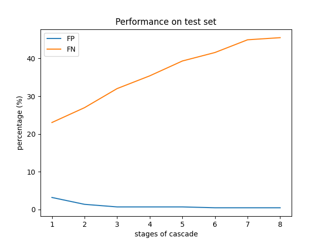
    <figcaption style="margin-top: 10px; font-size: 0.9em; color: #555;">Testing</figcaption>
  </figure>

<strong>Fig. 14:</strong> Object Detection: False Positive and False Negative Rates

[View Full Report](./reports/hw10_BilalAhmed.pdf)